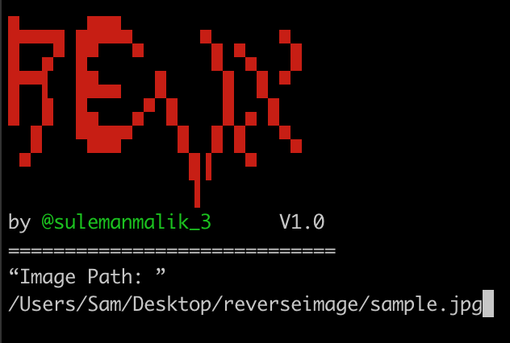

# Revx
RevX is a reverse image lookup script coded in shell & python2. 
# One Line code 
Paste the following code into the terminal and press the return key. Now drag an image file or type the file location into the terminal.
```
echo “Image: ”; read __inp__; [ ! -z ${__inp__} ]&& python -c "(lambda __g: [[[[[[[[(webbrowser.open(fetchUrl), None)[1] for __g['fetchUrl'] in [(response.headers['Location'])]][0] for __g['response'] in [(requests.post(searchUrl, files=multipart, allow_redirects=False))]][0] for __g['multipart'] in [({'encoded_image': (filePath, open(filePath, 'rb')), 'image_content': ''})]][0] for __g['searchUrl'] in [('http://www.google.hr/searchbyimage/upload')]][0] for __g['filePath'] in [('${__inp__}')]][0] for __g['os'] in [(__import__('os', __g, __g))]][0] for __g['webbrowser'] in [(__import__('webbrowser', __g, __g))]][0] for __g['requests'] in [(__import__('requests', __g, __g))]][0])(globals())" || exit 1;
```


